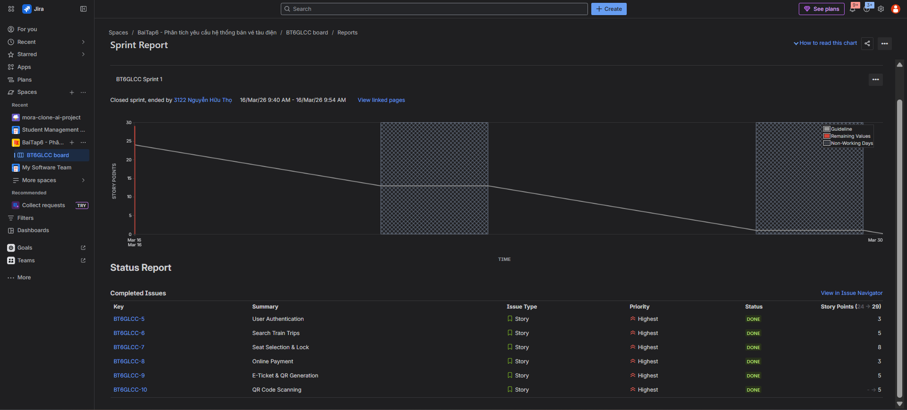
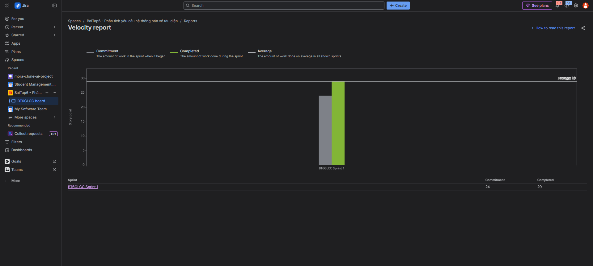

# BÁO CÁO SPRINT 1 - HỆ THỐNG BÁN VÉ TÀU ĐIỆN METRO
**Dự án:** MTS (Metro Ticket System)

---

## 1. Thông tin Sprint
- **Tên dự án:** Hệ thống bán vé tàu điện Metro (MTS)
- **Số sprint:** Sprint 1 (Sprint Cốt lõi - MVP)
- **Thời gian:** 02/03/2026 – 15/03/2026
- **Quy mô nhóm:** 3 người
- **Thành viên và vai trò:**
  - **Đinh Xuân Lộc (2280610666):** Trưởng nhóm, BA, Docs, QA (Viết test case, quản lý Jira).
  - **Nguyễn Hữu Thọ (2280603122):** Frontend Developer (React/HTML-CSS), UI/UX.
  - **Phạm Đỗ Quang Long (2280601785):** Backend Developer (API, Database), DevOps.

## 2. Sprint Goal (Mục tiêu Sprint)
**"Hoàn thành luồng mua vé cốt lõi (Happy Path): Từ lúc Khách hàng tìm chuyến, chọn ghế, thanh toán (mô phỏng), sinh vé QR cho đến khi Nhân viên quét mã QR xác nhận thành công."**

## 3. Cam kết đầu Sprint (Planned Backlog)
Nhóm đã kéo các User Story vào Sprint 1 trên Jira với cam kết ban đầu là **24 Story Points**.

| Story ID | Mô tả hạng mục | Chức năng liên quan | Ưu tiên | Người phụ trách | Ước lượng |
| :--- | :--- | :--- | :--- | :--- | :--- |
| **US-01** | Đăng ký & Đăng nhập | F01, F02 | Must | Long + Thọ | 3 SP |
| **US-02** | Tìm chuyến theo ga/thời gian | F04, F05, F06, F07 | Must | Thọ + Long | 5 SP |
| **US-03** | Chọn ghế & Giữ ghế (Lock) | F08, F09 | Must | Thọ + Long | 8 SP |
| **US-04** | Thanh toán online (mô phỏng) | F10, F12 | Must | Long | 3 SP |
| **US-05** | Nhận vé điện tử mã QR | F13, F15 | Must | Long | 5 SP |

*Tổng cam kết: 24 SP.*

## 4. Kết quả thực hiện (Sprint Results)
Dựa trên báo cáo từ Jira, nhóm đã hoàn thành vượt mức cam kết.
- **Cam kết:** 24 SP
- **Hoàn thành:** 29 SP
- **Tỷ lệ:** ~120% (Hoàn thành thêm các task phụ trợ và tối ưu giao diện).

*(Hình ảnh báo cáo từ Jira: Sprint Report và Velocity Chart)*

### 4.1. Đã hoàn thành (Done)
| Hạng mục | Trạng thái | Bằng chứng |
| :--- | :--- | :--- |
| **US-01** | Done | Giao diện Login/Register hoạt động, validate dữ liệu. |
| **US-02** | Done | API trả về danh sách chuyến tàu theo ga đi/đến < 1.5s. |
| **US-03** | Done | Sơ đồ ghế hiển thị rõ trạng thái Trống/Đã chọn. Logic giữ ghế 10 phút hoạt động ổn định. |
| **US-04** | Done | Tính tổng tiền đúng, gọi API thanh toán giả lập thành công. |
| **US-05** | Done | Mã QR được sinh ra sau thanh toán, lưu vào lịch sử vé. |
| **US-06 (Thêm)** | Done | Chức năng quét mã QR (F17) hoàn thiện sớm hơn kế hoạch. |

### 4.2. Chưa hoàn thành / Còn tồn đọng
| Hạng mục | Trạng thái | Lý do | Xử lý tiếp |
| :--- | :--- | :--- | :--- |
| **F14** (Gửi email vé) | In Progress | Lỗi cấu hình SMTP server. | Chuyển sang Sprint 2 sử dụng dịch vụ mail third-party. |
| **F18, F19** (Admin) | Not Started | Ưu tiên hoàn thiện luồng khách hàng trước. | Kéo vào Sprint 2. |

## 5. Demo luồng nghiệp vụ chính
Video demo và hình ảnh chụp màn hình minh chứng cho luồng sau:
1.  **Đăng nhập:** Thành công với tài khoản user hợp lệ.
2.  **Tìm chuyến:** Chọn ga đi (Cát Linh) -> Ga đến (Hà Đông). Hệ thống trả về danh sách chuyến.
3.  **Chọn ghế:** Click vào ghế trống -> Ghế đổi màu vàng -> Tổng tiền cập nhật.
4.  **Thanh toán:** Nhập thông tin thẻ giả lập -> Nhấn thanh toán -> Thông báo Success.
5.  **Sinh QR:** Vé xuất hiện trong mục "Vé của tôi" kèm mã QR duy nhất.
6.  **Quét vé:** Mở màn hình Soát vé -> Quét mã QR ở trên -> Hệ thống báo "Vé Hợp Lệ" (Màu xanh).

## 6. Chất lượng và kiểm thử (Quality & Testing)
Nhóm QA đã thực hiện test thủ công và tự động các chức năng chính.

- **Tổng số Test Case:** 10 (Đáp ứng tiêu chí bài tập).
- **Kết quả:** 9 Pass / 1 Fail.

**Chi tiết kết quả Test:**

| ID | Kịch bản | Kết quả mong đợi | Kết quả thực tế | Ghi chú |
| :--- | :--- | :--- | :--- | :--- |
| TC01 | Tìm chuyến hợp lệ | Hiển thị danh sách | **Pass** | |
| TC02 | Tìm chuyến trùng ga đi/đến | Báo lỗi | **Pass** | |
| TC03 | Chọn 1 ghế trống | Đổi màu, tính tiền | **Pass** | |
| TC04 | Chọn quá 4 ghế | Báo lỗi giới hạn | **Pass** | |
| TC05 | Giữ ghế (chờ thanh toán) | Đếm ngược 10 phút | **Pass** | |
| TC06 | Hết hạn giữ ghế | Nhả ghế, báo lỗi | **Pass** | |
| TC07 | Thanh toán thành công | Sinh mã QR | **Pass** | |
| TC08 | Quét QR hợp lệ | Báo "Vé Hợp Lệ" | **Pass** | |
| TC09 | Quét lại QR cũ | Báo "Vé Đã SD" | **Pass** | |
| TC10 | Đăng nhập sai 3 lần | Khóa tài khoản | **Pass** | |

## 7. Mức độ đáp ứng tiêu chí Bài Tập 6

| Tiêu chí bài tập | Trạng thái | Bằng chứng |
| :--- | :--- | :--- |
| Đầy đủ danh sách chức năng (F01-F20) | **Đạt** | Đã định nghĩa trong Backlog tổng. |
| Demo luồng mua vé đến quét QR | **Đạt** | Video/Screenshot màn hình Sprint Report. |
| Có ít nhất 10 test cases | **Đạt** | Mục 6 báo cáo. |
| Backlog Jira rõ ràng | **Đạt** | Screenshot Velocity Chart & Sprint Report. |
| Tài liệu và code đồng bộ | **Đạt** | Github repo commit logs. |

## 8. Vấn đề, Rủi ro & Bài học (Retrospective)
- **Vấn đề (Concurrency):** Xử lý tranh chấp ghế khi 2 người đặt cùng lúc. Đã khắc phục bằng cơ chế Lock Database.
- **Vấn đề (Environment):** Lỗi HTTPS khi test camera quét QR trên điện thoại. Đã fix tạm bằng ngrok.
- **Bài học:** Cần thống nhất API contract sớm hơn để Frontend và Backend chạy song song hiệu quả hơn.

## 9. Kế hoạch Sprint 2
- **Mục tiêu:** Hoàn thiện quản trị hệ thống (Admin Dashboard) và Cá nhân hóa người dùng.
- **Các task chính:**
  - Hoàn thiện gửi Email (F14).
  - Quản lý tuyến tàu, giá vé (F18, F19).
  - Chức năng hủy vé (F16).